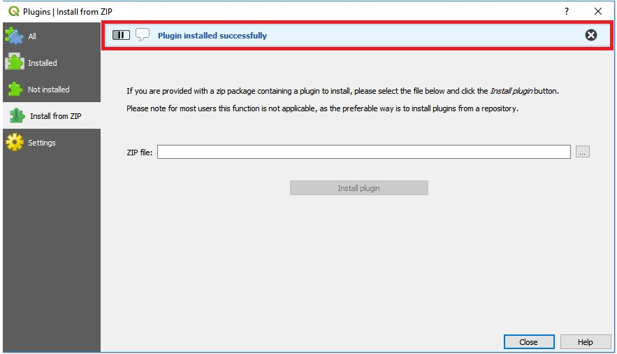

# agrodem_plugin
Test repository for the Agrodem plugin

## Installation 

### Requirements

- QGIS [3.4](https://qgis.org/en/site/forusers/download.html)
- Python >= 3.6 with the following packages installed:
	- PyQt5
	- shutil
	- qgis
	- datetime

### Adding plugin on QGIS

1.	Download the zipped plugin folder onto your computer.
2.	Open QGIS Desktop (proper version)
3.	Click on the "Plugins" menu

	

4.	Go to "Manage and Install Plugins..."

	

5.	Choose Install from ZIP
 	
	

6.	In the window that opens click on the three dots next to the empty field to navigate to where you saved the zipped plugin folder
	
	

7.	Select it and click "Install plugin"
 	
	

8.	An installation progress bar will appear on top of the screen
	
	

9.	After the plugin is installed it appear under the "Plugins" menu with the name HRSL Clustering. It is now ready to use!
	
	

## Using the plugin

1.	Open the plugin in QGIS

2.	Add necessary input layers

* River network (lines or multilines)
* Reservoirs (polygons)
* The admin boundaries layer for the area of interest (polygons) ([GADM](https://gadm.org/))

**Note** Apart from these layers you will also need a csv describing the agricultural areas in your area of interest. This csv should **not** be added into QGIS, instead you should select it using the button hihglighted below. The input csv should contain the following information:

1. **pixel** - Unique id for each pixel of the agricultural area
2. **State** - Name of the dissagregated states 
3. **lon** - Longitude (in EPSG:4326)
4. **lat** - Latitude (in EPSG:4326)
5. **Crop** - Crop in area
6. **Fraction** - The Fraction that is cultivated
7. **CropArea** - Area occupied by crop 

3.	Run the plugin

If succesful, the resulting layers will be added in your workspace. Three additional columns will be added to the ones mentioned above:

1. **elevation** - Elevation of closest surface water point [m]
2. **sw_dist** - Distance to closest surface water [km]
3. **sw_suitabilit** - Factor describing suitability of using the closest surface water point [1 = suitable, 9999 = not suitable] 

Sample input/output files are available for Mozambique